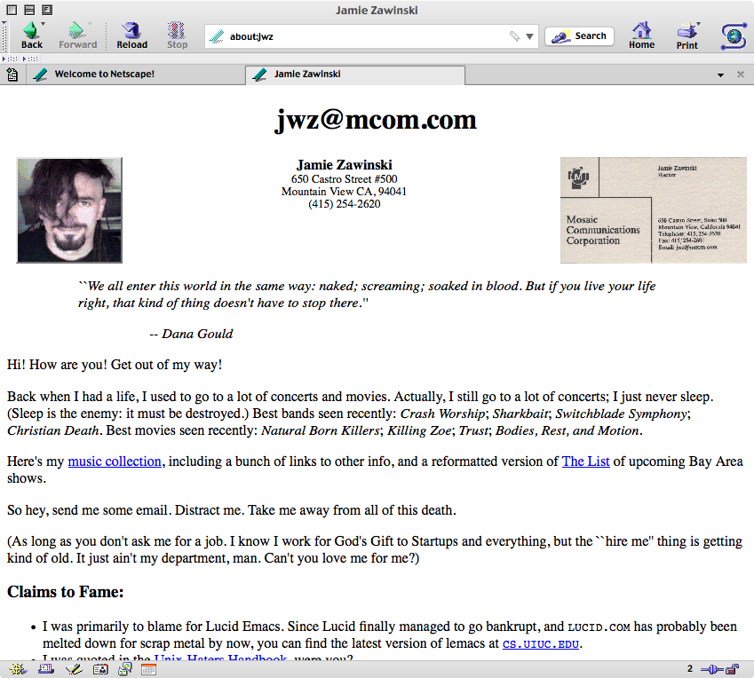
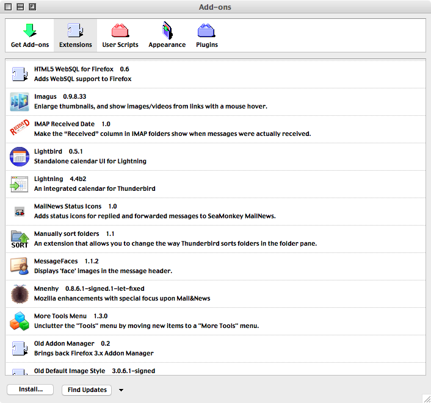
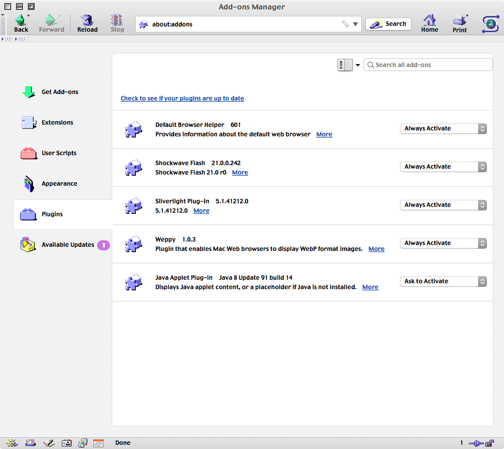
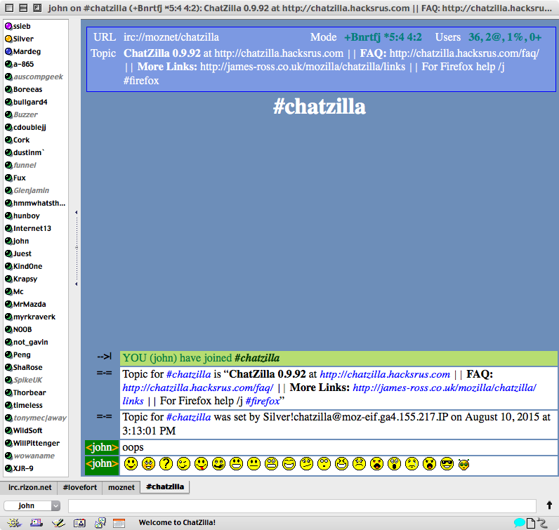
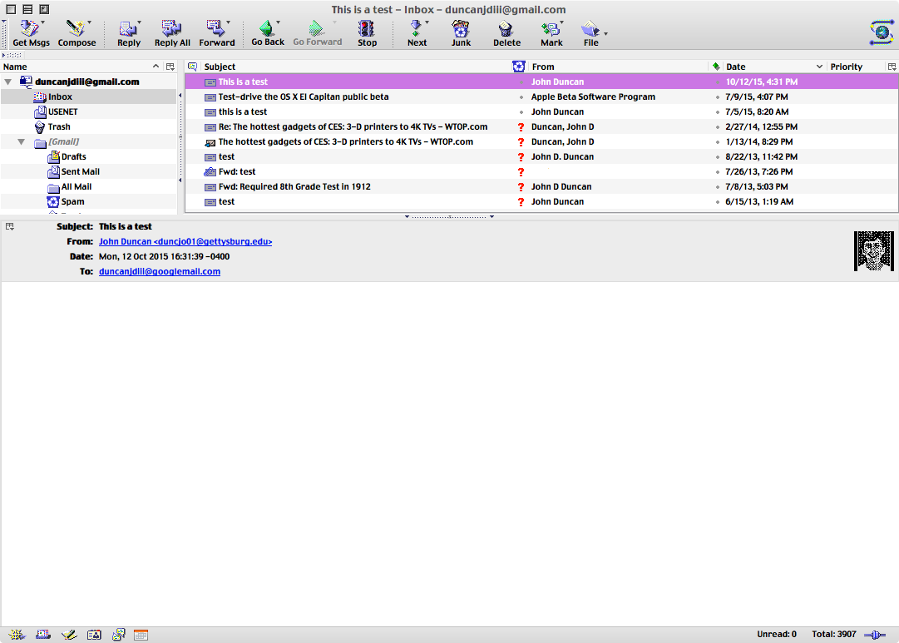
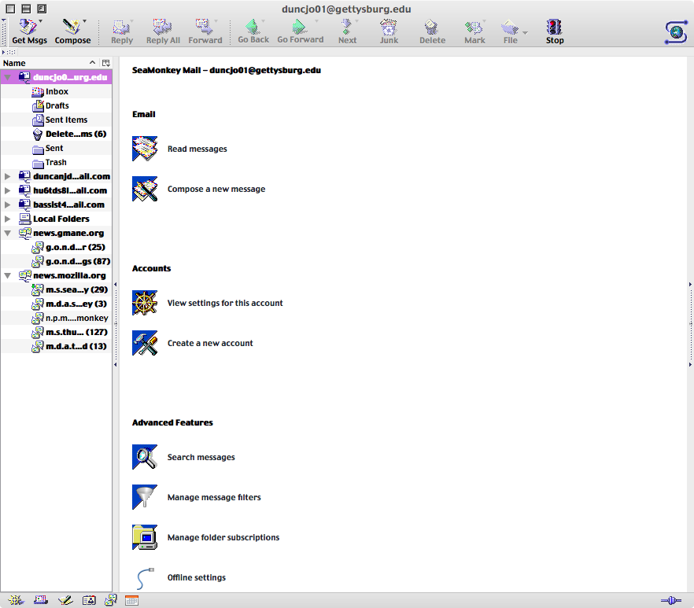
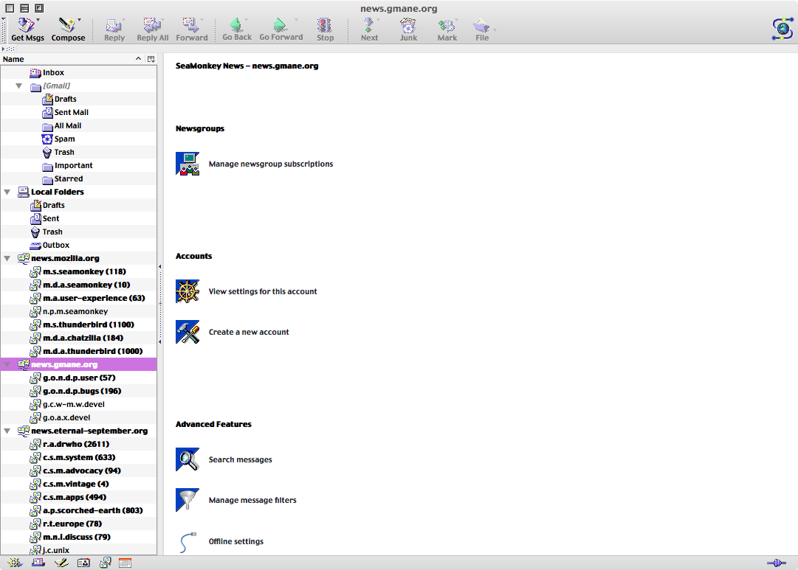
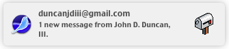

Orthodox for SeaMonkey
-------------------------------
A re-implementation of the classic Mozilla/Netscape theme

Changes made in version 0.1.2
-------------------------------
* fixed tabs on OS X
* added all classic ChatZilla user status icons/graphics
* added all classic ChatZilla smileys/emoticons. Some created by me to fill in the gaps.
* added all classic smileys to communicator (primarily for mailnews stuff)
* added classic all icons to messenger/accountcentral
* added classic notification icon for new mail
* added retro icons from broken/outdated [“Classic Default 0.8” extension](https://addons.mozilla.org/en-US/seamonkey/addon/classic-default/) to add-on manager. Works with [OAM](https://github.com/Exalm/old-addon-manager) as [well](https://dl.dropboxusercontent.com/u/36782044/oam-0.2.xpi)
* clean about:addons .css imported from the GNU/Linux version (OS X defaults are particularly ugly)
* added retro error, exclaim, message, question, etc. graphics in global/icons
* added light autoscroll as default. dark autoscroll also included (defaults to dark on OS X, looks bad, changed to light).

Screenshots
-------------------------------

